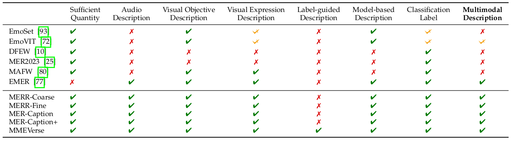
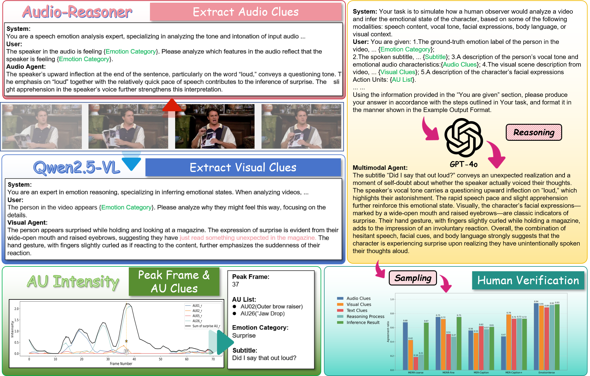
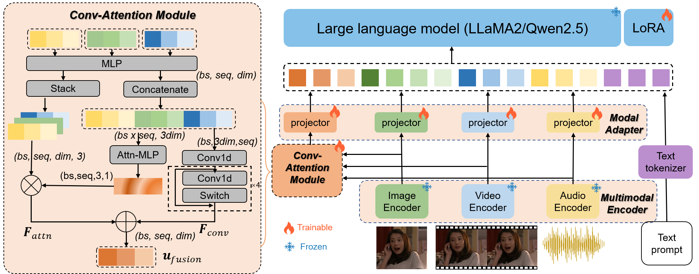
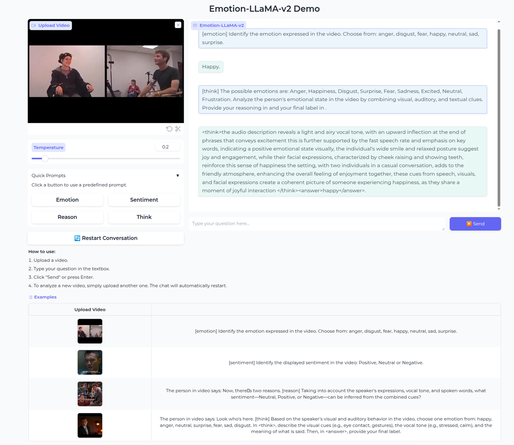

# Emotion-LLaMA-v2


<!-- ## 🌟 Overview -->

## 📂 Dataset
### Comparison of Emotional Dataset

### MMEVerse annotating pipeline

## Emtion-LLaMA-v2


## 🧩 ModelZoo

### General Checkpoints
|Model Name |Model Type|
| ---- | ---- |
|[whisper-large-v3](https://huggingface.co/openai/whisper-large-v3)| Audio Encoder|
|[eva-vit-g](https://storage.googleapis.com/sfr-vision-language-research/LAVIS/models/BLIP2/eva_vit_g.pth)|Visual Encoder|
|[Llama-2-7b-chat-hf](https://huggingface.co/meta-llama/Llama-2-7b-chat-hf)|LLM|
|[minigptv2](https://github.com/Vision-CAIR/MiniGPT-4)|MLLM|


### Pretrained EmotionLLaMA-v2 Checkpoints
|Emotion-LLaMA-v2(stage-1)|Emotion-LLaMA-v2(stage-2)
|----|----|
|[Download]()|[Download]()|

## ⚙️ Setup

### Environment
``` shell
git clone https://github.com/ooochen-30/Emotion-LLaMA-v2.git
cd Emotion-LLaMA-v2
conda create --name emotion-llama-v2 python=3.10.16
conda activate emotion-llama-v2
pip install -r requirement.txt
```

### 🎬 Demo



#### Local Demo
1. Download encoders and set paths in [extract_features.py](my_utils/extract_features.py)
```python
model_path = "/home/user/big_space/models/openai/whisper-large-v3"

cached_file = '/home/user/.cache/torch/hub/checkpoints/eva_vit_g.pth'
```

2. Download Emotion-LLaMA-v2 demo checkpoint and set in [demo.yaml](eval_configs/demo.yaml)

```yaml
ckpt: "/home/user/big_space/Emotion-LLaMA-v2/checkpoints/save_checkpoint/20250829210/checkpoint_9.pth"
```

3. Run and enjoy it
```shell
python app.py

# After running the code, click the following link to experience the demo webpage: 
# Running on local URL: http://127.0.0.1:7860
```

## 🏋️ Training

1. Prepare dataset

Download the [dataset](minigpt4/datasets/Dataset.md) you need and configure the [dataset config file](minigpt4/configs/datasets/default.yaml)
```yaml
datasets:
  dataset_name:
    data_type: images
    build_info:
      image_path: the/path/to/dataset
      ann_path: the/path/to/according/label
```


You may customize your own tasks(e.g., emotion recognition, multimodal reasoning, or “thinking” mode) by modifying the instruction pools.

```python
self.emotion_instruction_pool = [
    # "...",
]
self.think_instruction_pool = [
    # "...",
]      

self.task_pool = ["emotion", "think", "reason"]
```


Register datasets in [Here](minigpt4/datasets/builders/image_text_pair_builder.py)
```python
@registry.register_builder("caer")
class CAERBuilder(MERDatasetBuilder):
    train_dataset_cls = CAERDataset
    DATASET_CONFIG_DICT = {
        "default": "configs/datasets/mer/caer.yaml",
    }
```

2. Feature Extraction

In Emotion-LLaMA-v2, we use Whisper-Large-v3 as the audio encoder, and EVA is used to extract global features and video temporal features. During the training process, we do not load all encoders but instead use pre extracted features. You can use the [here](my_utils/extract_features.py) for feature extraction, and you can also switch to any other encoder.
```shell
# whisper-large-v3
python extract_features.py extract_whisper_audio_features dataset_name
# eva-vit-g
python extract_features.py extract_eva_vit_g_features dataset_name
```


3.  Set [Training configuration](train_configs/emotion_llama_v2_pretrain.yaml)

```yaml
# Set the LLM path at Line 7
llama_model: "/home/user/Emotion-LLaMA-v2/checkpoints/Llama-2-7b-chat-hf"
# Load the pretrained minigptv2 checkpoint at Line 8
ckpt: "/home/user/Emotion-LLaMA-v2/checkpoints/minigptv2/minigptv2_checkpoint.pth"
```


4. Run Training
``` shell
# stage 1
CUDA_VISIBLE_DEVICES=0,1,2,3 torchrun --nproc-per-node 4 train.py --cfg-path train_configs/emotion_llama_v2_pretrain.yaml
# stage 2
CUDA_VISIBLE_DEVICES=0,1,2,3 torchrun --nproc-per-node 4 train.py --cfg-path train_configs/emotion_llama_v2_finetune.yaml
```
## 🔍 Inference

### Dataset Inference

Specify the path to the pretrained checkpoint of Emotion-LLaMA in the [evaluation config file](eval_configs/emotionllamav2_mer_evaluation.yaml):

```yaml
llama_model: "/home/user/Emotion-LLaMA-v2/checkpoints/Llama-2-7b-chat-hf"
ckpt: "/home/user/Emotion-LLaMA-v2/checkpoints/save_checkpoint/xxx/checkpoint_best.pth"
save_path: /home/user/Emotion-LLaMA-v2/results/Emotion/xxx/checkpoint_best
```

```shell
export PYTHONPATH=$PYTHONPATH:/home/user/Emotion-LLaMA-v2
CUDA_VISIBLE_DEVICES=0 torchrun --nproc_per_node 1 eval_emotion_llama_v2.py --cfg-path eval_configs/emotionllamav2_mer_evaluation.yaml --dataset mer2023
```

### Evaluation

```shell
# score.sh
ROOT_DIR="/path/to/the/infer/result"
bash score.sh
```

### Single Sample

```shell
python inference.py
```

## 🙏 Acknowledgements
- [Emotion-LLaMA](https://proceedings.neurips.cc/paper_files/paper/2024/file/c7f43ada17acc234f568dc66da527418-Paper-Conference.pdf): Multimodal Emotion Recognition and Reasoning.
- [MiniGPT-v2](https://arxiv.org/abs/2310.09478): Large Language Model as a Unified Interface for Vision-Language Multi-task Learning.
- [AffectGPT](https://arxiv.org/abs/2306.15401): Explainable Multimodal Emotion Recognition.
- [LLaVA](https://llava-vl.github.io/): Large Language-and-Vision Assistant.

## 📖 Citation
If you find our work helpful for your research, please consider giving a star and citation
```bibtex
@inproceedings{NEURIPS2024_c7f43ada,
  author = {Cheng, Zebang and Cheng, Zhi-Qi and He, Jun-Yan and Wang, Kai and Lin, Yuxiang and Lian, Zheng and Peng, Xiaojiang and Hauptmann, Alexander},
  booktitle = {Advances in Neural Information Processing Systems},
  editor = {A. Globerson and L. Mackey and D. Belgrave and A. Fan and U. Paquet and J. Tomczak and C. Zhang},
  pages = {110805--110853},
  publisher = {Curran Associates, Inc.},
  title = {Emotion-LLaMA: Multimodal Emotion Recognition and Reasoning with Instruction Tuning},
  url = {https://proceedings.neurips.cc/paper_files/paper/2024/file/c7f43ada17acc234f568dc66da527418-Paper-Conference.pdf},
  volume = {37},
  year = {2024}
}

@inproceedings{10.1145/3689092.3689404,
  author = {Cheng, Zebang and Tu, Shuyuan and Huang, Dawei and Li, Minghan and Peng, Xiaojiang and Cheng, Zhi-Qi and Hauptmann, Alexander G.},
  title = {SZTU-CMU at MER2024: Improving Emotion-LLaMA with Conv-Attention for Multimodal Emotion Recognition},
  year = {2024},
  isbn = {9798400712036},
  publisher = {Association for Computing Machinery},
  address = {New York, NY, USA},
  url = {https://doi.org/10.1145/3689092.3689404},
  doi = {10.1145/3689092.3689404},
  abstract = {This paper presents our winning approach for the MER-NOISE and MER-OV tracks of the MER2024 Challenge on multimodal emotion    recognition. Our system leverages the advanced emotional understanding capabilities of Emotion-LLaMA to generate high-quality annotations for unlabeled samples, addressing the challenge of limited labeled data. To enhance multimodal fusion while mitigating modality-specific noise, we introduce Conv-Attention, a lightweight and efficient hybrid framework. Extensive experimentation validates the effectiveness of our approach. In the MER-NOISE track, our system achieves a state-of-the-art weighted average F-score of 85.30\%, surpassing the second and third-place teams by 1.47\% and 1.65\%, respectively. For the MER-OV track, our utilization of Emotion-LLaMA for open-vocabulary annotation yields an 8.52\% improvement in average accuracy and recall compared to GPT-4V, securing the highest score among all participating large multimodal models. The code and model for Emotion-LLaMA are available at https://github.com/ZebangCheng/Emotion-LLaMA.},
  booktitle = {Proceedings of the 2nd International Workshop on Multimodal and Responsible Affective Computing},
  pages = {78–87},
  numpages = {10},
  keywords = {mer2024, noise robustness, open-vocabulary recognition},
  location = {Melbourne VIC, Australia},
  series = {MRAC '24}
}
```


## 📜 License
This repository is under the [BSD 3-Clause License](./LICENSE.md). Code is based on MiniGPT-4 with BSD 3-Clause License [here](./LICENSE_MiniGPT4.md). Data is from MER2023 and licensed under [EULA](./LICENSE_EULA.md) for research purposes only.